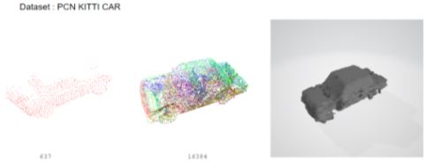
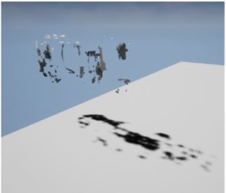

# 3D mesh generation with real world lidar data

## 과제 개요

###  과제 설계 배경 및 필요성

메타버스라는 키워드가 등장하면서 컴퓨터 상에서 3D를 구현하는 방법이 많이 연구되고 있다. 많은 연구 중 3D mesh generation이 눈에 띈다. Pixel2Mesh, Point2Mesh의 방법을 통해 2D 이미지에서 3D mesh를 3D point cloud에서 3D mesh를 만들어낼 수 있다.
이렇게 만들어진 3D mesh는 3D printer, Game 등에 쓰일 수 있다. 3D mesh를 만드는 작업은 굉장히 비용이 높은 작업이다. 주변의 이미 존재하는 재료들을 가지고 3D mesh를 만들 수 있다면 3D mesh를 만드는데 드는 비용을 줄일 수 있을 것이다.

###  과제 주요내용

본 과제에서는 real world lidar data로부터 3D mesh를 생성한다. real world lidar data는 incomplete하다. 왜냐하면 self-occlusion이 발생하기 때문이다. 따라서 incomplete data를 complete data로 만들어주는 과정이 필요하다.
real world lidar data는 self-occlusion이 발생하기 때문에 불완전하다. real world를 잘 이해하기 위해서는 partial을 complete으로 바꾸는 과정이 필요하고 이를 point cloud completion이라고 한다. 이 과제에서는 PCN 딥러닝 모델을 사용했다.
point cloud completion을 통해 partial를 complete으로 바꾼 다음, complete point cloud를 3D mesh로 바꾼다. 이 과제에서는 Point2Mesh의 가장 고전적인 방법인 Possion reconstruction을 사용했다.

### 최종결과물의 목표

real world lidar data로부터 3D mesh를 생성하는 것이 목표다. 이를 통해 real world lidar 데이터를 사용해 3D mesh를 사용하는 task에 도움을 줄 수 있을지 탐색해본다.

## 과제 수행방법

Point cloud completion은 Deep learning method를 사용한다. 2021년 기준 유명한 모델들을 PCN Dataset에 대해 비교해보고 가장 성능이 좋은 것을 선택하려고 했으나 현실적인 문제로 PCN 모델을 사용했다.
Point2Mesh는 고전적으로 사용되는 방법인 Possion reconstruction을 사용했다. Open3D 라이브러리를 사용해 point cloud들의 normal vector를 추정한 다음, 이상치를 제거한 후 Possion reconstruction을 진행했다.

## 수행결과

### 과제수행 결과

### 최종결과물 주요특징 및 설명

첫번째 과정은 637개의 포인트를 16384개의 포인트로 업샘플링한다. 이 과정이 point cloud completion이다. 다음으로 16384의 포인트를 이용해 Possion reconstruction을 진행한다.

## 기대효과 및 활용방안

### 기대효과

메타버스라는 키워드와 VR, AR이라는 키워드가 부상하면서 3D mesh를 요하는 곳이 많아졌다. 우리는real lidar data를 가지고 3D mesh를 만들 수 있다. 이를 통해 3D mesh를 만들어낼 수 있는 채널이 다양해질 수 있다.

### 활용방안

3D mesh를 3D printer에도 활용할 수 있고 Game에도 활용할 수 있다. AR, VR에 사용될 수 있고 메타버스를 구현하는데 사용될 수 있다.

## 결론 및 제언

3D mesh를 Unreal Engine으로 불렀을 때 위와 같이 렌더링 이슈가 발생한다. Normal vector의 추정에서 에러가 있는 것으로 보인다. 따라서 현재의 방법으로는 게임에서의 사용은 무리고 3D Printer에서 사용이 가능하다.

## 참고자료

* Xin Wen, Zhizhong Han, Yan-Pei Cao, Pengfei Wan, Wen Zheng, and Yu-Shen Liu. Cycle4completion: Unpaired point cloud completion using cycle transformation with missing region coding. In Proceedings of the IEEE/CVF Conference on Computer Vision and Pattern Recognition, pages 13080–13089, 2021.
* Xin Wen, Tianyang Li, Zhizhong Han, and Yu-Shen Liu. Point cloud completion by skip-attention network with hierarchical folding. In Proceedings of the IEEE/CVF Conference on Computer Vision and Pattern Recognition, pages 1939–1948, 2020.
* Chulin Xie, Chuxin Wang, Bo Zhang, Hao Yang, Dong Chen, and Fang Wen. Style-based point generator with adversarial rendering for point cloud completion. In Proceedings of the IEEE/CVF Conference on Computer Vision and Pattern Recognition (CVPR), pages 4619–4628, June 2021.
* Xumin Yu, Yongming Rao, Ziyi Wang, Zuyan Liu, Jiwen Lu, and Jie Zhou. Pointr: Diverse point cloud completion with geometry-aware transformers. In Proceedings of the IEEE/CVF International Conference on Computer Vision, pages 12498–12507, 2021.
* Wentao Yuan, Tejas Khot, David Held, Christoph Mertz, and Martial Hebert. Pcn: Point completion network. In 3DV, pages 728–737. IEEE, 2018.
* Yingjie Cai, Kwan-Yee Lin, Chao Zhang, Qiang Wang, Xiaogang Wang, Hongsheng Li. Learning a Structured Latent Space for Unsupervised Point Cloud Completion, CVPR, 2022.
* Yida Wang, David Joseph Tan, Nassir Navab, Federico Tombari. Learning Local Displacements for Point Cloud Completion, CVPR, 2022.
